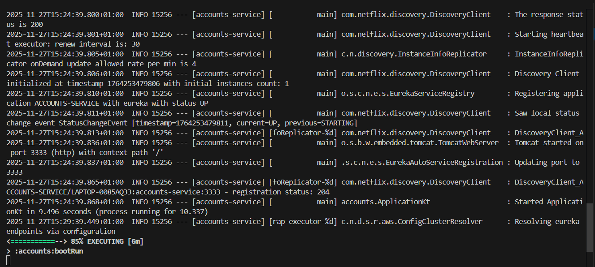
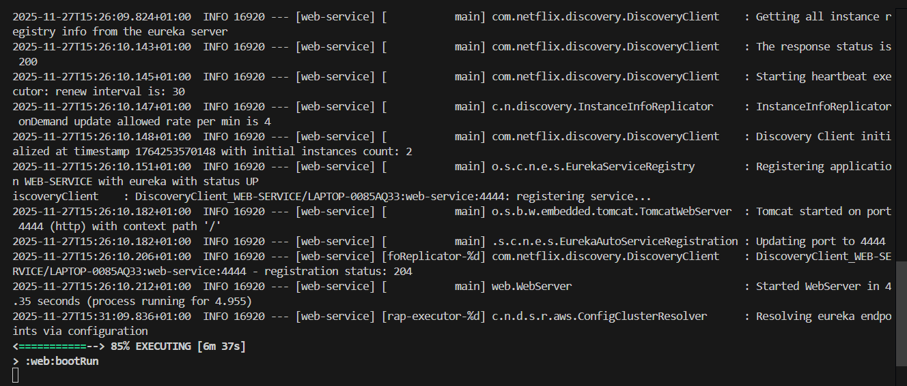
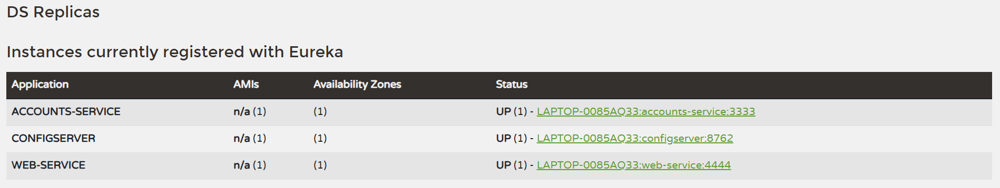
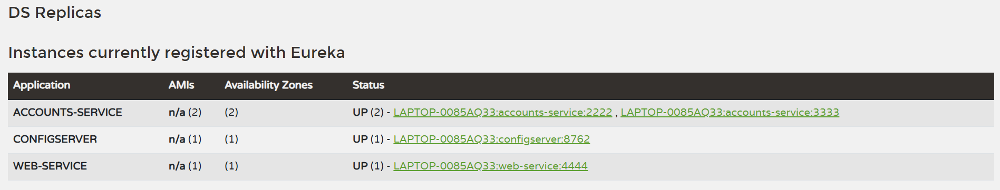
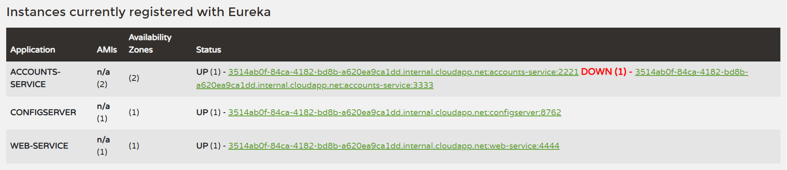
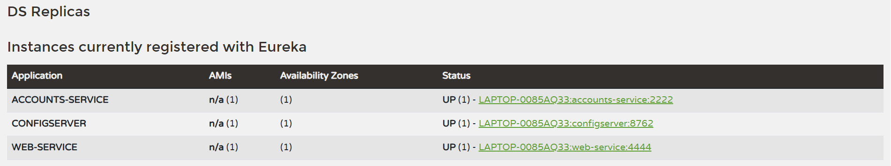
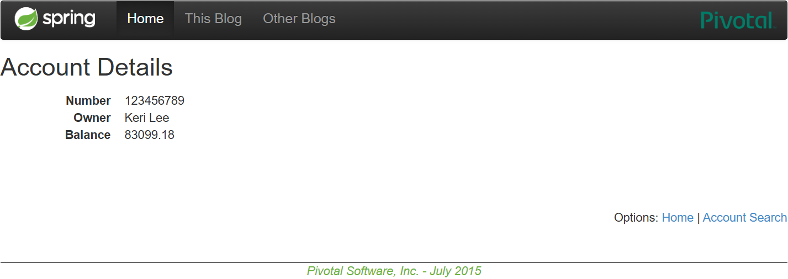

# Lab 6 Microservices - Project Report

## 1. Configuration Setup

**Configuration Repository**: https://github.com/marta-gl0/lab6-microservices-marta-gl0.git

Changes made to the configuration:

- What did you modify in `accounts-service.yml`?

    Changed the port from 3333 to 2222.

- Why is externalized configuration useful in microservices?

    Externalized configuration in microservices allows settings like service endpoints, databases, or feature flags to be managed separately from the code, enabling flexibility across environments (development, testing, production) and easier updates without redeployment. It supports centralized management, dynamic updates, improved security for sensitive data, and automatic configuration for multiple service instances, helping microservices scale reliably while decoupling what the service does from how it behaves in a specific environment.

---

## 2. Service Registration (Task 1)

### Accounts Service Registration



What happens during service registration:

1. **The service loads its configuration from the Config Server:** Right after startup, before creating the application context, the service contacts the Config Server and loads configuration such as server port and Eureka client settings.
    ```
    Fetching config from server at : http://localhost:8762
    Located environment: name=accounts-service, profiles=[default]
    ```

2. **The service discovers where Eureka is located:** Spring Cloud automatically knows the default Eureka URL (`http://localhost:8761/eureka`).
    ```
    Initializing Eureka in region us-east-1
    Resolving eureka endpoints via configuration
    ```

3. **The service initializes Spring Boot (JPA, Tomcat, Controllers, etc.):** Before registration, the service finishes all its internal initialization.

4. **Eureka client sets instance status to STARTING:**
    ```
    Setting initial instance status as: STARTING
    ```

5. **The service fetches the current registry from Eureka:**
    ```
    Getting all instance registry info from the eureka server
    The response status is 200
    ```

6. **The service begins sending heartbeats:**
    ```
    Starting heartbeat executor: renew interval is: 30
    ```

7. **The service registers itself in Eureka:**
    ```
    Registering application ACCOUNTS-SERVICE with eureka with status UP
    DiscoveryClient_ACCOUNTS-SERVICE/...: registering service...
    registration status: 204
    ```

### Web Service Registration



How the web service discovers the accounts service:

1. **The web service starts and registers itself with Eureka:** When web-service boots, it runs the `DiscoveryClient` and sends a registration request to Eureka. This makes Eureka aware that the web service is alive.
    ```
    DiscoveryClient_WEB-SERVICE ... registering service...
    registration status: 204
    ```

2. **The web service retrieves the registry from Eureka:** The web service downloads a list of all available services, including accounts-service, configserver and web-service (itself). This list is cached inside the `DiscoveryClient`.
    ```
    Getting all instance registry info from the eureka server
    The response status is 200
    ```
---

## 3. Eureka Dashboard (Task 2)



What the Eureka dashboard shows:

- Services registered:
    - **Accounts service:** Registered in port 3333.
    - **Config service:** Registered in port 8782.
    - **Web service:** Registered in port 4444.

- What information does Eureka track for each instance?
    - **Hostname** and **instance ID** (e.g., `LAPTOP-0085AQ33:accounts-service:2222`)

    - **Application name** (e.g., `ACCOUNTS-SERVICE`)

    - **Port** where the service is running

    - **Status/health** (e.g., `UP`)

    - **Availability zone:** number of instances running

    - **AMIs (Amazon Machine Images):** not available in this case, the application is not running in amazon services

---

## 4. Multiple Instances (Task 4)



- **What happens when you start a second instance of the accounts service?**

    When a second instance starts, it registers itself with Eureka. Eureka then displays two entries for the same application name (`ACCOUNTS-SERVICE`), each with its own port and instance ID. Both appear with status UP if they are healthy.

- **How does Eureka handle multiple instances?**

    Eureka groups all instances under the same application name. For each application, Eureka keeps a registry list of all active instances, including host, port, health status and metadata.

    Eureka also performs heartbeats to check if each instance is alive and eviction of instances that stop sending renewals.

- **How does client-side load balancing work with multiple instances?**

    With multiple instances, each client:

    1. Ask Eureka for the list of active instances of a service.

    2. Choose one instance based on a load-balancing strategy.

    3. Send the request directly to the selected instance.

    This results in automatic distribution of traffic, resilience (if one instance goes `DOWN`, it is simply not chosen) and no need to know instance addresses manually.

---

## 5. Service Failure Analysis (Task 5)

### Initial Failure



What happens immediately after stopping the accounts service on port 3333:

Immediately after stopping the accounts service instance on port 3333, Eureka detects that the instance is no longer sending heartbeat signals. The instance is marked as unavailable (`DOWN`) in the Eureka dashboard.

**Notes:** This section was executed in GitHub Codespaces, while the rest of the tasks were performed locally. An issue occurred with port 2222 inside Codespaces, so the service was reconfigured to run on port 2221 instead.

### Eureka Instance Removal



Explain how Eureka detects and removes the failed instance: 

- **How long did it take for Eureka to remove the dead instance?**

    About 1 second, due to `eviction-interval-timer-in-ms: 1000`.

- **What mechanism does Eureka use to detect failures?**

    Eureka uses a heartbeat mechanism. Each service instance periodically sends a heartbeat to the Eureka server. If heartbeats stop, Eureka marks the instance as expired and schedules it for removal during the next eviction cycle.

---

## 6. Service Recovery Analysis (Task 6)



Answer the following questions:

- **Why does the web service eventually recover?**

    The web service is configured to use Eureka for service discovery. Once the accounts service is removed from Eureka, the web service refreshes its cached registry and finds the remaining healthy instance of the accounts service, allowing requests to succeed again.

- **How long did recovery take?**

    Recovery happens almost immediately after Eureka evicts the failed instance, between 1 and 2 seconds, depending on the web service’s cache refresh timing.

- **What role does client-side caching play in the recovery process?**

    Client-side caching stores a snapshot of available service instances from Eureka to reduce network requests and improve performance. When an instance fails:

    - The cache may temporarily contain the failed instance.

    - Once the cache is refreshed (via Eureka polling or Spring Cloud LoadBalancer refresh), the web service sees only healthy instances and resumes sending traffic correctly.

    This caching ensures resilience while minimizing Eureka server load, but it introduces a slight delay between the server evicting the dead instance and the client using the updated registry.

---

## 7. Conclusions

Through this lab, I gained a practical understanding of how microservices operate as independently deployable components that collaborate through well-defined interfaces. I learned how Eureka enables service discovery by allowing services to register themselves, announce their status through heartbeats, and discover other services dynamically without relying on hard-coded addresses. The lab demonstrated how the system remains resilient: when an instance fails, Eureka quickly detects the missing heartbeat, evicts the instance, and clients recover as soon as their cached registry updates, illustrating the self-healing nature of distributed systems. 

I encountered typical microservices challenges such as stale caches, configuration delays, and issues syncing service states. Capturing the exact moment when an instance turned `DOWN` was difficult locally because the failed instance was not being removed correctly, so I switched to GitHub Codespaces to obtain the required screenshots and observe the `DOWN` state accurately. These problems were ultimately resolved by tuning Eureka’s lease, eviction, and heartbeat settings and analyzing logs and dashboard updates to better understand how services interact in real time.

---

## 8. AI Disclosure

**Did you use AI tools?**

Yes. I used ChatGPT to help refine explanations, summarizing concepts and clarifying Eureka’s internal mechanisms.

**What did I do myself?**

I completed all the technical work, including running the microservices, modifying configurations, testing multiple instances, analyzing failures, observing the Eureka dashboard, and collecting logs and screenshots. I also provided the factual content and interpreted the system behavior based on my own experimentation. All explanations provided by the AI were reviewed and correctly integrated into the report.

**My own understanding:**

Through this lab I learned how microservices rely on decentralized components, each running independently. Eureka enables service discovery by keeping an updated registry of all instances, detecting failures through heartbeats, and removing dead services based on lease expiration and eviction cycles.

---

## Additional Notes

The experiment highlighted how Eureka’s behavior is closely tied to its configuration, particularly settings related to lease renewal, expiration, and eviction. Adjusting these values made system behavior more visible and easier to observe during the lab. Overall, the lab provided a clear understanding of how configuration, service discovery, and failure handling interact to support resilient microservice architectures.

